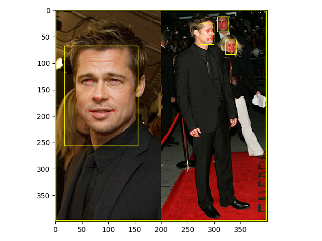

# 人脸检测


### 集群上训练

```shell
./run.sh
```

### 测试

```shell
python3 main_test.py
```

### 参考文献:
1. [MTCNN](https://arxiv.org/abs/1604.02878v1): Joint Face Detection and Alignment using Multi-task Cascaded Convolutional Networks
2. [Dface](https://github.com/kuaikuaikim/DFace): Deep learning face detection implemented by pytorch.
3. [PyTorch-Project-Template](https://github.com/moemen95/PyTorch-Project-Template): A scalable template for PyTorch projects

### 项目结构:
```
├── configs：配置文件
|  └── mtcnn_exp_o0.json
|  └── mtcnn_exp_p0.json
|  └── mtcnn_exp_r0.json
|
├── data：训练列表
|  └── prepare：中间数据
|
├── data_prepare：数据集预处理
|  └── 300-W_ANNO
|  └── CelebA_ANNO
|  └── WIDER_ANNO
|
├── dataloaders：数据集读取
|
├── experiments：训练过程
|  └── experiment：训练名称
|  |  └── checkpoints：网络参数
|  |  └── log：训练日志
|  |  └── summaries：Tensorboard可视化目录
|
├── graphs：网络
|  └── models：网络结构
|  |  └── base_model.py
|  |  └── mtcnn.py
|  |
|  └── losses：损失函数
|     └── mtcnn_loss.py
|
├── infers：前向网络
|
├── trainers：训练目录
|  └── base.py
|  └── mtcnn.py
|
├── utils
|
├── main_prepare.py：预处理数据
├── main_test.py：测试网络
├── main_train.py：训练网络
└── run.sh
```


