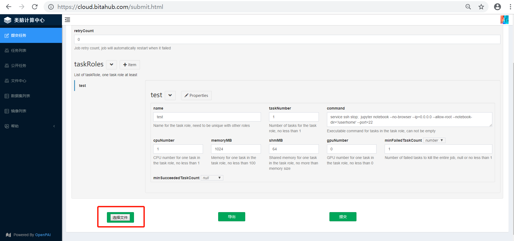
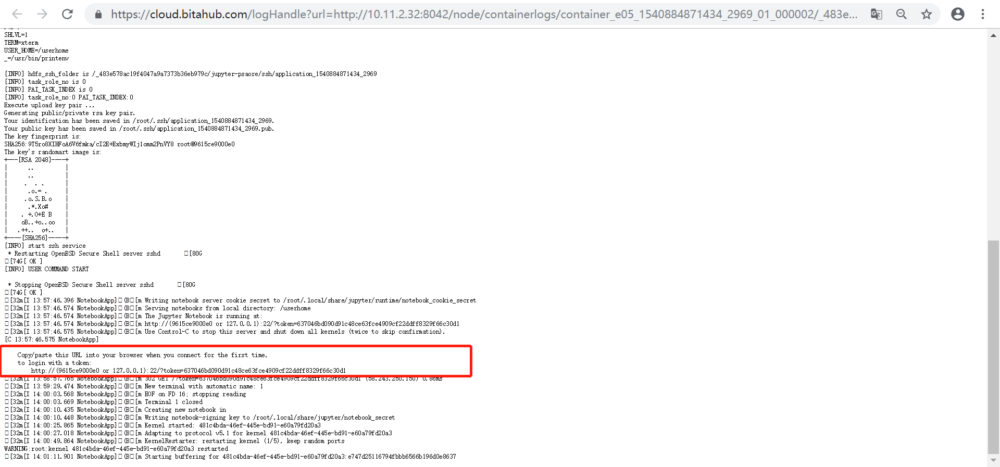
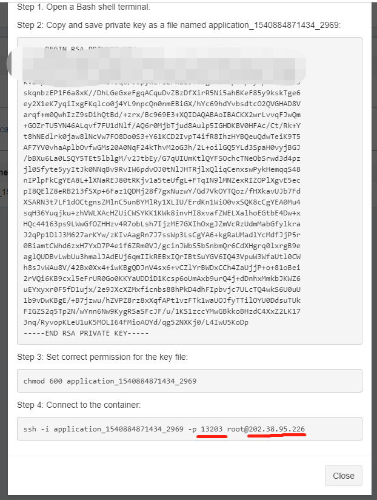
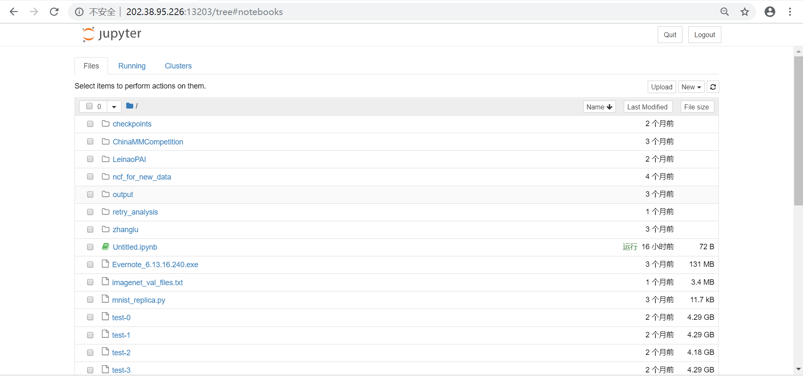

## 怎么在平台中启动jupyter

### 一、操作步骤

1. 下载[任务json](https://raw.githubusercontent.com/Leinao/LeinaoPAI/master/example/start-jupyter/start-jupyter.json)
2. 提交任务



3. 用浏览器访问jupyter网址

（1）打开任务日志，找到jupyter启动后输出的网址信息



（2）保持token不变，替换ip地址和端口。打开任务的ssh信息：



在上图中ip为202.38.95.226，端口为13203，因此jupyter网址为：http://202.38.95.226:13203/?token=637046bd090d91c48ce63fce4909cf22ddff8329f66c30d1。打开后可以得到类似的页面：



**注意：请根据具体任务的不同，改变`ip`、`端口`和`token`。**

### 二、参数解释
1. 任务提交的json如下：

```json
{
    "jobName": "jupyter-bsvu7x",
    "image": "10.11.3.8:5000/user-images/deepo:all-jupyter-py36-cu90",
    "gpuType": "debug",
    "retryCount": 0,
    "taskRoles": [
        {
            "name": "test",
            "taskNumber": 1,
            "cpuNumber": 1,
            "memoryMB": 1024,
            "shmMB": 64,
            "gpuNumber": 0,
            "minFailedTaskCount": 1,
            "minSucceededTaskCount": null,
            "command": "service ssh stop;  jupyter notebook --no-browser --ip=0.0.0.0 --allow-root --notebook-dir='/userhome' --port=22"
        }
    ]
}
```

其中：

* “gpuType” : "debug" 为必选项，我们这里将ssh替换为jupyter，并借用ssh的外部端口
* “command”中的`service ssh stop`将ssh服务停止，以空出22号端口，之后在jupyter启动时指定了监听端口为22

注：这是暂时最快的启用jupyter的方法，后续会进一步优化