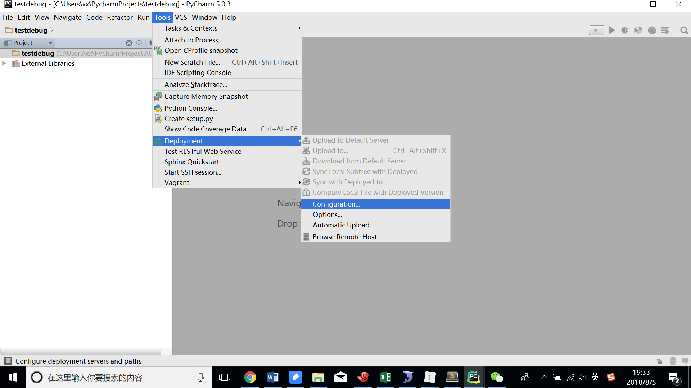
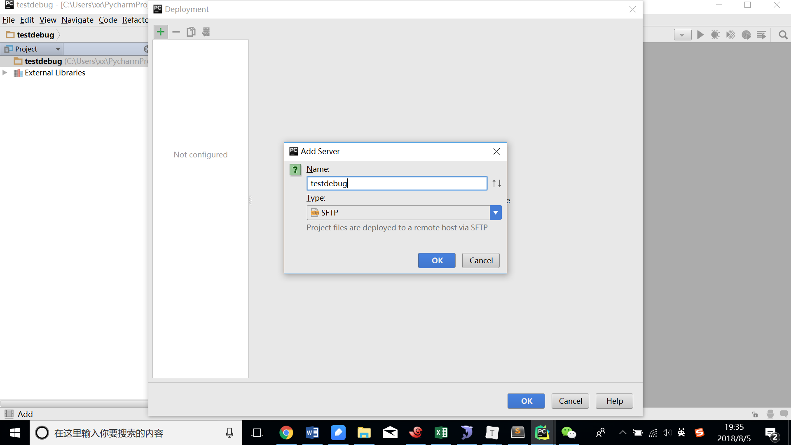
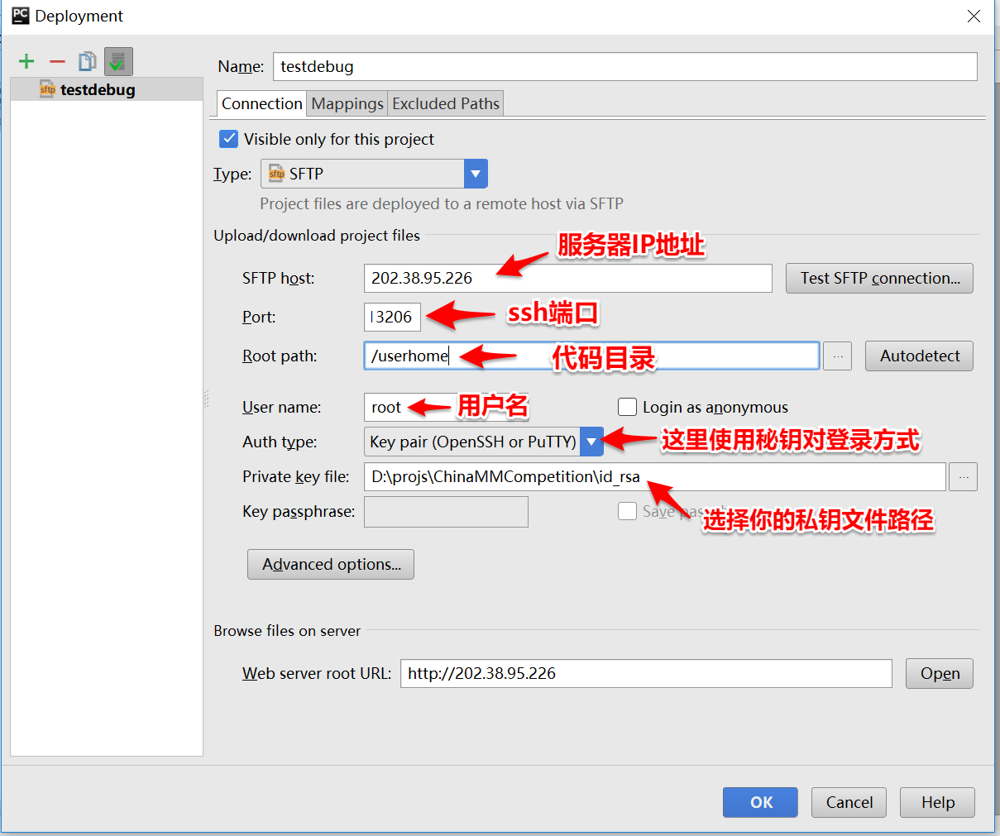
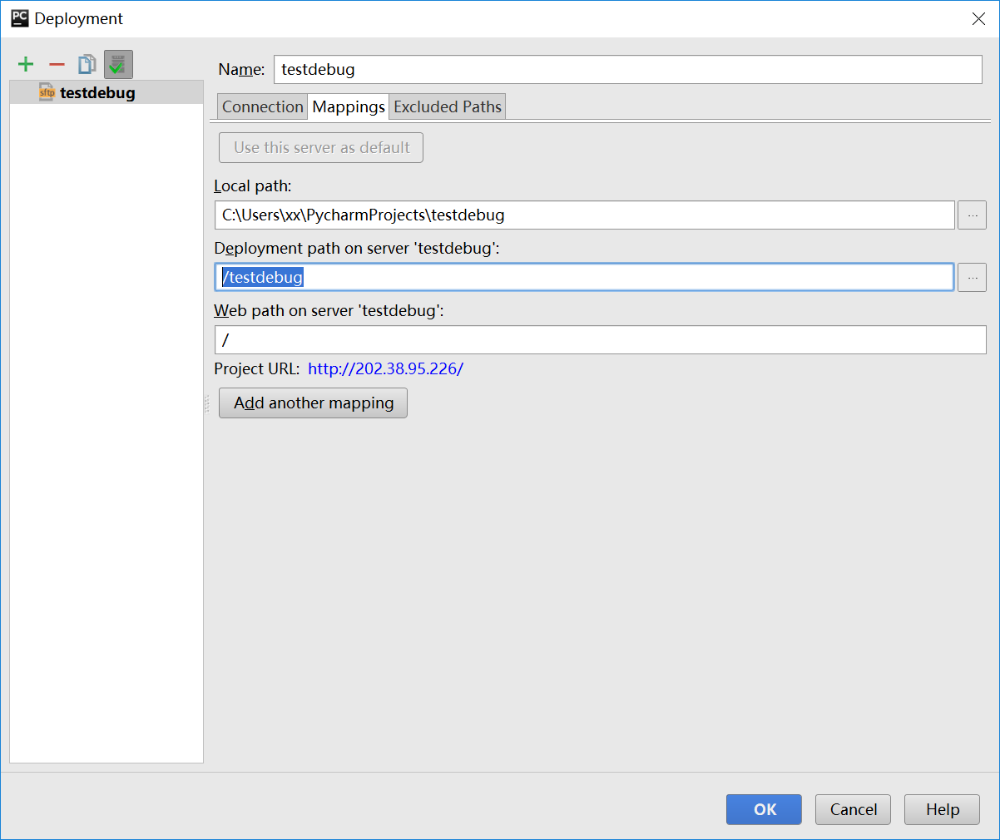
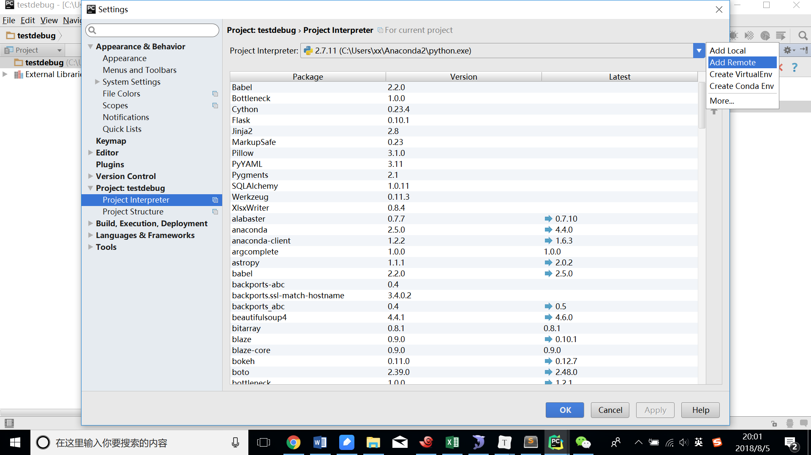
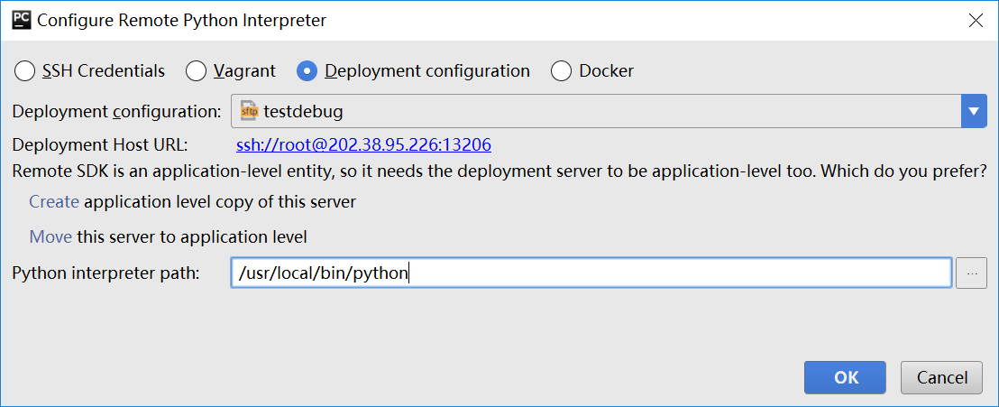
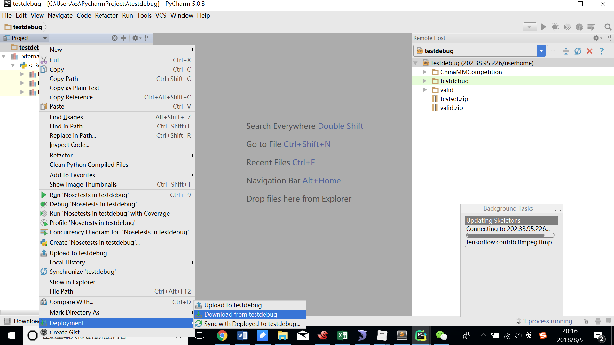
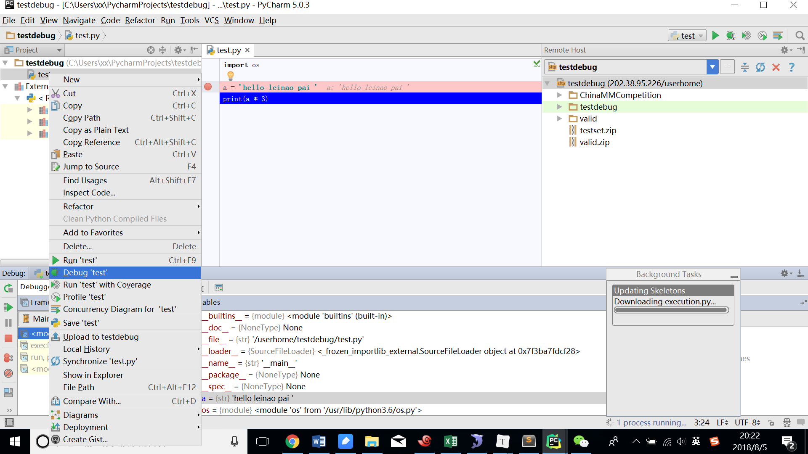

pycharm是一款流行的python IDE，用户可以很方便地在pycharm中编写代码、可视化地调试。很多初学者会有这样的疑问，如果我要在**远程服务器**上调试python代码，是否还能像在本地一样方便呢？**答案是肯定的**，pycharm就能实现。你需要做以下4步。

```
增加远程服务器
设置解释器为服务器上的python
下载代码
启动调试
```
### 1. 增加远程服务器 

（1）打开pycharm，新建一个空白项目。

（2）点击Tools->Deployment->Configuration，开始配置远程服务器






在上图中，注意将Type选择为SFTP。



在上图标注位置，填入服务器的登录信息。其中，认证方式可以选择密码方式，也可以选择密钥对方式（如果你是我们[平台](https://202.38.95.226:6443)的用户，需要选择这一方式，具体秘钥的获取方式见[这里](https://www.bitahub.com/views/article-detail.html?articleId=_f0bf8a2c89b94945bb95c83e97815039)）。



设置“Mappings”中的“Deployment path on server *testbug*”，令其指向具体的项目（假设该项目目录的绝对路径为/userhome/testdebug）。

点击"Test SFTP connection"，若弹出”Success connected to ..."表示配置无误。

### 2. 设置解释器为服务器上的python

（1）点击Files->Settings->Project:xxx->Project Interpreter，点击其中的“设置”按钮，选择Add Remote



（2）配置服务器信息，选择“Deployment configuration”，选择在上一步配置的服务器信息，并填入服务器上python的路径（可以通过“which python”查找默认python的路径）



（3）点击OK后，项目的解释器就设置为远程服务器上的python，pycharm需要一些时间来同步设置。

###　3. 下载代码

（１）点击Tools->Deployment->Browse Remote Host，可以查看远程服务器上的文件

（2）在项目标题上点击右键后，选择Deployment->Download from *testdebug*，将从服务器上下载代码



### 4.启动调试

（1）打开.py文件，设置断点，右键点击该文件，选择"Debug ..."。**远程调试成功。**



（2）因解释器在远程，若在本地更改了代码，需要同步到服务器后才能生效。这时候，可以点击Tools->Deployment->Upload to *testdebug*。也可以勾选Tools->Deployment->Automatic Upload，此后当本地有修改时会自动同步到服务器。

